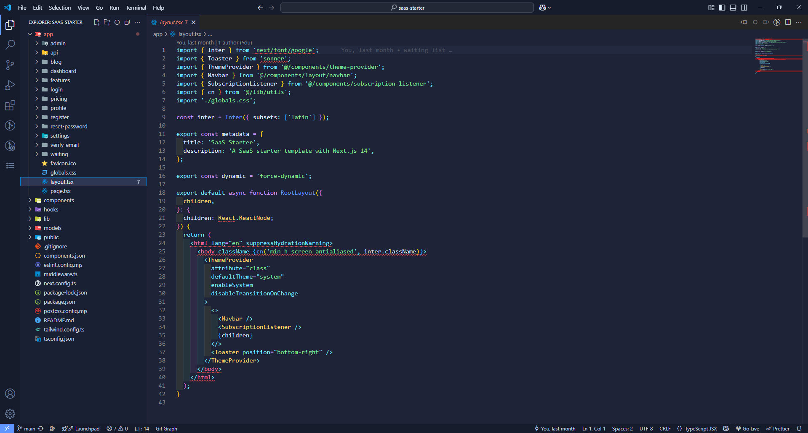
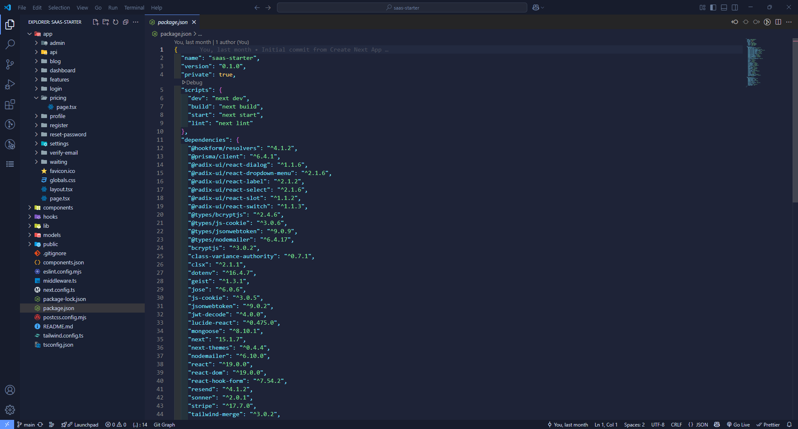

# Cielo Theme for VS Code

A modern, vibrant VS Code theme inspired by Halcyon but with a more energetic feel.

## Features

* Vibrant yet eye-friendly color palette
* Modern syntax highlighting
* Carefully designed UI elements
* Optimized readability for long coding sessions

## Screenshots





## Installation

1. Open **Extensions** sidebar in VS Code (`Ctrl+Shift+X` or `Cmd+Shift+X`)
2. Search for `Cielo Theme`
3. Click **Install**
4. Click **Reload**
5. Select the theme: Code > Preferences > Color Theme > **Cielo**

## Customization

If you want to customize specific aspects of the theme:

1. Go to `File > Preferences > Settings`
2. Search for `workbench.colorCustomizations`
3. Add your overrides inside the brackets

Example:

```json
"workbench.colorCustomizations": {
  "[Cielo]": {
    "editor.background": "#1A1E2D"
  }
}
```

## Feedback and Contributions

Feedback and contributions are welcome! Please file issues or submit pull requests on the [GitHub repository](https://github.com/ahlgren1234/cielo-theme).

## License

[MIT](./LICENSE)
